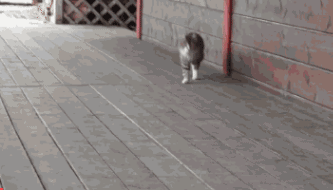
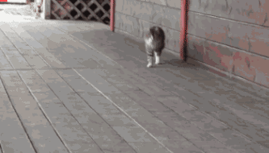
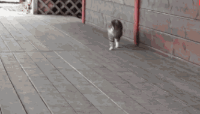

## Android Progress Gif Library
A Gif Library simplely add a progress bar to the gif,so we can know where we are when viewing a long duration gif.

## How it looks
### DefaultProcessor#TOP


### DefaultProcessor#BOTTOM


### SquareProgressProcessor#TOP_LEFT


### SquareProgressProcessor#TOP_CENTER


### SquareProgressProcessor#TOP_RIGHT


## How to use
gradle

```
implementation 'com.davesla:progressgif:0.1.1'

```

usage

```java
ProgressGif.Builder builder = new ProgressGif.Builder();
ProgressGif progressGif = builder
		.setDestPath(destPath)
		.setSavePath(savePath)
		.setScale(0.95f)
		.setGifQuality(ProgressParams.GifQuality.MEDIUM)
		.setProcessor(new DefaultProcessor())
		.setProcessListener(new GifProcessListener() {
		    @Override
		    public void onStart() {
			//...
		    }

		    @Override
		    public void onProgress(final Bitmap bitmap, float progress) {
			runOnUiThread(new Runnable() {
			    @Override
			    public void run() {
				//...
			    }
			});
		    }


		    @Override
		    public void onError(Exception e) {
			//...
		    }

		    @Override
		    public void onComplete() {
			//...
		    }
		})
		.build();
progressGif.startAsync();
```

## Implementation
```java
public class MyProcessor implements Processor {
    @Override
    public Bitmap process(Bitmap originBitmap, float progress) {
	Bitmap bitmap = null;
	//draw progress as you want...
	return bitmap;
    }
}
//...
ProgressGif.Builder builder = new ProgressGif.Builder();
builder.setProcessor(new MyProcessor());
//...
```
## Reference
GIF Decoder is originally based on [android-ndk-gif](https://github.com/waynejo/android-ndk-gif)
